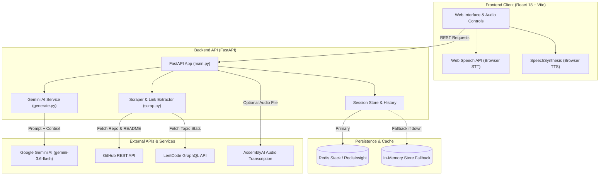
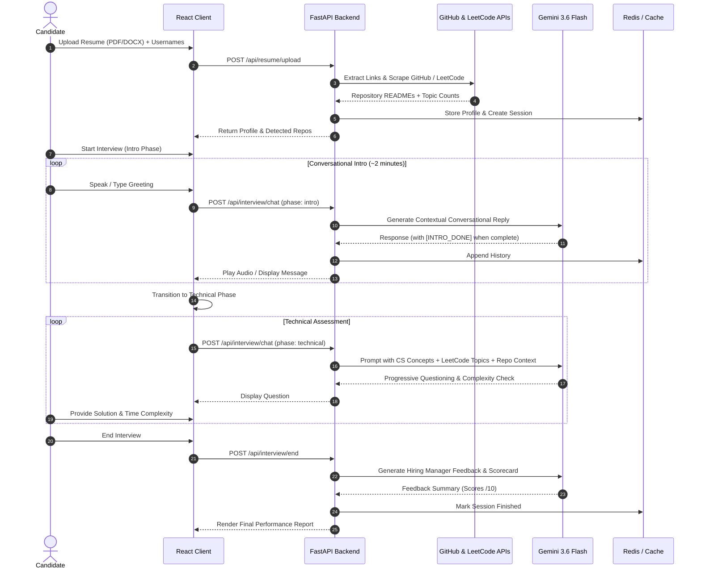

# Asses.ai 🎙️🤖

> **An AI-powered technical interview platform simulating real-world engineering interviews with contextual RAG, dynamic profile enrichment, voice interaction, and structured performance evaluations.**

---

[](https://fastapi.tiangolo.com)
[](https://reactjs.org/)
[](https://vitejs.dev/)
[](https://tailwindcss.com/)
[](https://ai.google.dev/)
[](https://redis.io/)
[](https://www.docker.com/)

---

## Table of Contents

- [Overview](#overview)
- [Key Features](#key-features)
- [System Architecture](#system-architecture)
- [Interview Workflow](#interview-workflow)
- [Repository Structure](#repository-structure)
- [Tech Stack](#tech-stack)
- [Prerequisites](#prerequisites)
- [Configuration & Environment Variables](#configuration--environment-variables)
- [Getting Started](#getting-started)
  - [Method 1: Full-Stack with Docker Compose (Recommended)](#method-1-full-stack-with-docker-compose-recommended)
  - [Method 2: Local Manual Setup (Dev Mode)](#method-2-local-manual-setup-dev-mode)
  - [Method 3: Standalone CLI Agents](#method-3-standalone-cli-agents)
- [REST API Reference](#rest-api-reference)
- [Core Components Deep Dive](#core-components-deep-dive)
  - [Resume & Profile Scraper (RAG Context)](#1-resume--profile-scraper-rag-context)
  - [AI Engine & Runtime Key Management](#2-ai-engine--runtime-key-management)
  - [Session & History Management (Redis / In-Memory Fallback)](#3-session--history-management-redis--in-memory-fallback)
  - [Audio & Speech Pipeline](#4-audio--speech-pipeline)
  - [Web Client (React + Tailwind)](#5-web-client-react--tailwind)
- [Troubleshooting & FAQs](#troubleshooting--faqs)
- [License](#license)

---

## Overview

**Asses.ai** is an end-to-end intelligent mock interview simulation system designed to prepare software engineers for rigorous technical hiring processes. 

Unlike generic chatbots, Asses.ai extracts candidate credentials directly from their **resume (PDF or DOCX)**, identifies their **GitHub** and **LeetCode** profiles, and enriches the candidate context in real-time. Using **Retrieval-Augmented Generation (RAG)**, the platform tailors questions to the candidate's actual projects, code repositories, and algorithmic strengths/weaknesses.

The platform provides:
1. **A modern Web Application** featuring audio speech synthesis, real-time microphone transcription, candidate profile previews, live interview progress, and hiring manager scorecards.
2. **A resilient FastAPI Backend** with live key injection, graceful mock fallbacks, and automatic Redis container management.
3. **Interactive CLI Agents** for terminal-based voice or text interview simulations.

---

## Key Features

- 📄 **Smart Resume Parsing**: Automatically extracts hyperlinks and plain text URLs from uploaded PDF and DOCX files.
- 🐙 **Deep GitHub Scraping**: Fetches public repository descriptions, metadata, and README files, giving the AI concrete context about past projects.
- 🧩 **LeetCode Skill Analytics**: Queries LeetCode's GraphQL API to retrieve topic-level mastery (fundamental, intermediate, and advanced data structures and algorithms).
- 🧠 **Context-Aware RAG Interviewing**: Integrates candidate profile telemetry into prompt context, challenging candidates on their actual past projects and DSA history.
- 🔄 **Two-Phase Adaptive Interview Flow**:
  - **Introduction Round**: Warm-up dialogue and background dive (~2 minutes), ending with an automated `[INTRO_DONE]` state transition.
  - **Technical Round**: Core CS fundamentals (OOP, DBMS, System Concepts) followed by algorithmic problems with real-time complexity probing (pushing brute-force to optimal), ending with `[INTERVIEW_DONE]`.
- 🎙️ **Multi-Modal Voice Support**:
  - **Browser Web App**: Native Web Speech API recognition + SpeechSynthesis audio narration.
  - **Server Transcribe Proxy**: Secure AssemblyAI transcription endpoint.
  - **CLI Tools**: Hardware audio capture with PyAudio and offline TTS with `pyttsx3`.
- 🛡️ **Zero-Crash Resilience**:
  - **Mock Mode**: Works out of the box even before API keys are configured.
  - **Runtime Key Configuration**: Add or update Google Gemini / AssemblyAI keys directly from the Web UI without restarting the server.
  - **In-Memory Store Fallback**: Automatically switches to an in-memory dictionary if Redis or Docker is not running.
- 📊 **Hiring Manager Evaluation**: Concludes each session with an executive critique assessing Communication, CS Fundamentals, and Problem Solving on a 10-point scale with actionable feedback.

---

## System Architecture



---

## Interview Workflow



---

## Repository Structure

```
asses.ai/
├── docker-compose.yml           # Multi-container orchestration (client, server, redis)
├── .gitignore                   # Git exclusion rules
├── README.md                    # Comprehensive documentation
│
├── client/                      # React 18 + Vite frontend
│   ├── Dockerfile               # Multi-stage production build (Node 20 -> Nginx Alpine)
│   ├── nginx.conf               # Nginx reverse proxy configuration (/api -> server:8000)
│   ├── index.html               # Web HTML entry
│   ├── package.json             # NPM dependencies and scripts
│   ├── vite.config.js           # Vite build config
│   ├── tailwind.config.js       # Tailwind CSS configuration
│   ├── postcss.config.js        # PostCSS configuration
│   ├── .env.example             # Client environment template (VITE_API_URL)
│   └── src/
│       ├── App.jsx              # Main UI wizard (Upload, Review, Chat, Feedback, Key Modal)
│       ├── api.js               # API service client handling backend endpoints
│       ├── index.css            # Custom CSS and Tailwind directives
│       └── main.jsx             # React DOM root render
│
└── server/                      # Python FastAPI backend
    ├── Dockerfile               # Python 3.11-slim container with audio system libraries
    ├── main.py                  # FastAPI server entry point and endpoint handlers
    ├── generate.py              # Google Gemini integration, prompt wrappers, and mock fallback
    ├── redis_global.py          # Redis connection, Docker auto-start, in-memory fallback
    ├── requirements.txt         # Backend Python packages
    ├── .env.example             # Server environment template
    │
    ├── Agents/                  # Standalone CLI Interview Agents
    │   ├── intro.py             # Introduction phase script (terminal-based)
    │   └── concept.py           # Technical assessment script with LeetCode context
    │
    ├── Models/                  # Audio processing modules
    │   ├── record_audio.py      # PyAudio hardware recorder (Enter-key triggered)
    │   ├── speech_to_text.py    # AssemblyAI cloud speech-to-text integration
    │   └── text_to_speech.py    # pyttsx3 offline text-to-speech engine
    │
    ├── Scrapper/                # Profile scrapers & link extractors
    │   └── scrap.py             # PDF/DOCX parsing, GitHub REST API, LeetCode GraphQL
    │
    └── constant/                # Static assets & test samples
        └── resume.pdf           # Sample resume for verification testing
```

---

## Tech Stack

| Layer | Technology | Purpose |
| :--- | :--- | :--- |
| **Frontend Framework** | React 18 (`react`, `react-dom`) | Modern component-based user interface |
| **Build Tooling** | Vite 6 | Lightning-fast HMR and optimized production bundling |
| **Styling** | Tailwind CSS 3 + PostCSS | Sleek, responsive, dark-themed UI design |
| **Backend API** | FastAPI 0.100+ & Uvicorn | High-performance asynchronous Python REST API |
| **Data Validation** | Pydantic | Robust request/response schemas and typing |
| **AI LLM Engine** | Google Gemini (`gemini-3.6-flash`) | Core conversational and technical reasoning agent |
| **Document Parsing** | PyMuPDF (`fitz`) & `python-docx` | PDF and DOCX document text and link extraction |
| **Session Cache** | Redis Stack (`redis/redis-stack:latest`) | Session persistence, transcript tracking, RedisInsight |
| **In-Memory Store** | Custom `_MemoryRedis` | Resilient zero-dependency fallback when Redis is absent |
| **Audio Processing** | Web Speech API, PyAudio, `pyttsx3` | Bi-directional voice interaction |
| **Transcription** | AssemblyAI API | High-accuracy cloud speech-to-text |
| **Containerization** | Docker & Docker Compose | Containerized multi-tier deployment |
| **Reverse Proxy** | Nginx Alpine | Production asset serving and API request routing |

---

## Prerequisites

- **Docker & Docker Desktop** (recommended for zero-setup execution)
- **Python 3.10 or 3.11** (for local server development)
- **Node.js 18 or 20+** and **npm** (for local client development)
- **Git**

### API Keys (Optional but recommended for live AI)
1. **Google Gemini API Key**: [Get a Gemini API Key](https://aistudio.google.com/app/apikey).
2. **AssemblyAI API Key**: [Get an AssemblyAI Key](https://www.assemblyai.com/) *(optional; browser-native speech works by default)*.
3. **GitHub Personal Access Token**: *(Optional)* Set `GITHUB_TOKEN` to avoid GitHub public API rate limits when scraping repositories.

---

## Configuration & Environment Variables

### 1. Server Environment (`server/.env`)

Copy `server/.env.example` to `server/.env`:

```bash
cp server/.env.example server/.env
```

| Variable | Required | Default | Description |
| :--- | :---: | :---: | :--- |
| `GROQ_API_KEY` | Recommended | *(empty)* | Groq API key (ultra-fast inference, https://console.groq.com/keys). If empty and no Google key is set, the app runs in mock mode. |
| `GROQ_MODEL` | Optional | `llama-3.3-70b-versatile` | Groq model variant to use (e.g. `llama-3.3-70b-versatile`, `llama-3.1-8b-instant`). |
| `GOOGLE_API_KEY` | Optional | *(empty)* | Google Gemini API key (alternative / fallback). |
| `GEMINI_MODEL` | Optional | `gemini-3.6-flash` | Gemini model variant to use. |
| `ASSEMBLYAI_API_KEY` | Optional | *(empty)* | AssemblyAI API key for audio file transcription proxy. |
| `REDIS_HOST` | Optional | `localhost` | Redis host (`redis` inside Docker Compose). |
| `REDIS_PORT` | Optional | `6379` | Redis port. |
| `GITHUB_TOKEN` | Optional | *(empty)* | GitHub personal access token to prevent rate-limiting during repository scraping. |
| `SCRAP_TIMEOUT` | Optional | `10` | Timeout in seconds for individual web scraping network calls. |
| `SCRAP_MAX_REPOS` | Optional | `10` | Maximum number of repositories to scrape per resume. |
| `RAG_INDEX_NAME` | Optional | `idx:candidate_chunks` | Redis Stack vector index for candidate knowledge. |
| `RAG_KEY_PREFIX` | Optional | `rag:` | Key namespace prefix for RAG chunks. |
| `RAG_EMBEDDING_PROVIDER` | Optional | `local` | Embedding provider (`local` hash-based, or `gemini`). |
| `RAG_EMBEDDING_MODEL` | Optional | `models/gemini-embedding-001` | Embedding model (when using `gemini` provider). |
| `RAG_EMBEDDING_DIM` | Optional | `768` | Vector dimension: `768` default. |
| `RAG_TOP_K` | Optional | `4` | Default retrieval depth. |
| `RAG_PLANNER_STRATEGY` | Optional | `heuristic` | Question planner: `heuristic` or `llm`. |
| `RAG_ASSESS_MODE` | Optional | `llm` | Answer assessment: `llm` or `heuristic`. |
| `RAG_MAX_TURNS` | Optional | `20` | Max technical turns before guided wrap-up. |
| `RAG_CHUNK_CHARS` / `RAG_CHUNK_OVERLAP` | Optional | `1200` / `150` | Chunk window size / overlap. |
| `RAG_TTL_SECONDS` | Optional | `604800` | Chunk key expiry (7 days, `0` disables). |

> 💡 **Live Key Injection:** You can also enter your `GROQ_API_KEY` (or `GOOGLE_API_KEY` and `ASSEMBLYAI_API_KEY`) directly in the Web UI via the **"Connect API Key"** modal. The backend saves it to `server/.env` automatically without requiring a server restart.

### 2. Client Environment (`client/.env`)

Copy `client/.env.example` to `client/.env` (if custom backend URL is required):

```bash
cp client/.env.example client/.env
```

| Variable | Required | Default | Description |
| :--- | :---: | :---: | :--- |
| `VITE_API_URL` | Optional | *(empty / same-origin)* | Set to `http://localhost:8000` for standalone local client development. In Docker, leave empty to leverage Nginx proxy routing. |

### 3. RAG Security & Data Handling

```
Resume + GitHub + LeetCode
↓ Normalization ↓ Chunking ↓ Embeddings (gemini-embedding-001, 768-d)
↓ Redis Stack Vector Search (idx:candidate_chunks, HNSW cosine)
↓ Hybrid Retrieval (KNN + full-text, RRF fusion)
↓ Question Planner → Context Builder → Gemini
↓ Adaptive Interview → Structured Evaluation
```

* **Candidate isolation**: every chunk carries a `candidate_id` TAG; all retrieval filters on it at the RediSearch query level, keys live under `rag:{candidate_id}:*`, and results are re-checked in Python. Retrieval for one candidate can never return another's data.
* **Untrusted input**: resume/README/answer text is sanitized at prompt-build time (control chars stripped; forged `[INTERVIEW_DONE]` / `[CANDIDATE EVIDENCE]` markers neutralized); the system prompt treats evidence as data, never instructions.
* **Secrets**: keys live only in git-ignored, docker-ignored `server/.env` and are never returned by any endpoint or written to logs.
* **Graceful degradation**: Redis down → in-memory sessions, RAG disabled with warnings; bad key / malformed model output → heuristic fallbacks. The API never 500s on RAG failures.
* **Limits**: 10 MB uploads, 10 repos/resume, 10 s scrape timeouts, 7-day chunk TTL, 20-turn interview budget.
* Full RAG reference (schema, index design, phases): [`server/RAG/README.md`](server/RAG/README.md).

---

## Getting Started

### Method 1: Full-Stack with Docker Compose (Recommended)

Run the complete stack (Redis Stack, FastAPI backend, and React client) with a single command:

```bash
# 1. Clone the repository
git clone https://github.com/your-username/asses.ai.git
cd asses.ai

# 2. Build and start all services
docker compose up --build
```

Once started:
- 🌐 **Web Application**: Open [http://localhost:3000](http://localhost:3000)
- 🚀 **FastAPI Documentation**: Open [http://localhost:8000/docs](http://localhost:8000/docs)
- 📊 **RedisInsight GUI**: Open [http://localhost:8001](http://localhost:8001)

To stop the containers:
```bash
docker compose down
```

---

### Method 2: Local Manual Setup (Dev Mode)

#### Step 1: Start Redis (Optional)
If you have Docker Desktop running, the backend will automatically attempt to launch `redis-stack`. Alternatively, run:
```bash
docker run -d --name redis-stack -p 6379:6379 -p 8001:8001 redis/redis-stack:latest
```
*(If Redis is not running, the application will automatically fall back to its internal in-memory store).*

#### Step 2: Set Up & Run the Server
```bash
# Navigate to server directory
cd server

# Create and activate virtual environment
# On Windows:
python -m venv venv
.\venv\Scripts\Activate.ps1
# On macOS/Linux:
# python3 -m venv venv
# source venv/bin/activate

# Install dependencies
pip install -r requirements.txt

# Create .env file
copy .env.example .env
# Edit .env and paste your GOOGLE_API_KEY

# Start FastAPI server
python main.py
# Server runs on http://localhost:8000
```

#### Step 3: Set Up & Run the Client
Open a new terminal:
```bash
# Navigate to client directory
cd client

# Install dependencies
npm install

# Start Vite dev server
npm run dev
# Client runs on http://localhost:5173
```

> **Note on Local Port Proxying**: When running client on `http://localhost:5173` and server on `http://localhost:8000`, set `VITE_API_URL=http://localhost:8000` in `client/.env` or configure the Vite proxy in `vite.config.js`.

---

### Method 3: Standalone CLI Agents

You can run terminal-based interview sessions directly using the standalone agent scripts:

```bash
cd server/Agents

# Run Introduction Agent
python intro.py

# Run Technical Round Agent (uses intro context stored in Redis)
python concept.py
```

*These scripts support keyboard-based recording (`Models/record_audio.py`) and speech generation (`Models/text_to_speech.py`).*

---

## REST API Reference

The FastAPI backend exposes interactive OpenAPI docs at `http://localhost:8000/docs`.

### Endpoint Summary

| Method | Endpoint | Description | Request Body / Params |
| :--- | :--- | :--- | :--- |
| `GET` | `/` | API discovery and available endpoints list | None |
| `GET` | `/api/health` | Healthcheck (Redis status, Gemini key status, AssemblyAI status) | None |
| `POST` | `/api/settings/key` | Connect API keys at runtime and persist to `server/.env` | `{ "google_api_key": "...", "assemblyai_api_key": "...", "validate_key": true }` |
| `POST` | `/api/session` | Initialize a new interview session | None |
| `GET` | `/api/profile/{session_id}` | Retrieve parsed candidate profile for a given session | `session_id` path parameter |
| `POST` | `/api/resume/upload` | Upload resume (PDF/DOCX), scrape GitHub & LeetCode | `multipart/form-data` with `file`, `session_id?`, `leetcode_username?`, `github_url?` |
| `POST` | `/api/interview/chat` | Send user message, execute RAG prompt, receive AI reply | `{ "session_id": "...", "message": "...", "phase": "intro" \| "technical" }` |
| `GET` | `/api/interview/history/{session_id}` | Retrieve complete conversation history | `session_id` path parameter |
| `POST` | `/api/interview/end` | Finish interview and generate hiring manager scorecard | `{ "session_id": "..." }` |
| `POST` | `/api/transcribe` | Transcribe an uploaded audio file via AssemblyAI | `multipart/form-data` with `file` (`.webm` or `.wav`) |

---

## Core Components Deep Dive

### 1. Resume & Profile Scraper (RAG Context)
Located in [`server/Scrapper/scrap.py`](file:///c:/Users/Saket/OneDrive/Desktop/asses.ai/server/Scrapper/scrap.py):
- **Document Text Extraction**: Uses `PyMuPDF` (`fitz`) for PDF link and text parsing; uses `python-docx` for `.docx` files.
- **GitHub Crawler**: Detects repository links, calls `https://api.github.com/repos/{owner}/{repo}`, retrieves descriptions, and fetches base64-encoded `README.md` files. Individual repository failures are isolated to prevent batch timeouts.
- **LeetCode GraphQL Integration**: Executes a GraphQL query against `https://leetcode.com/graphql/` fetching solved problem counts categorized into **fundamental**, **intermediate**, and **advanced** topics (e.g., Arrays, Hash Tables, Trees, Graphs, Dynamic Programming).

### 2. AI Engine & Runtime Key Management
Located in [`server/generate.py`](file:///c:/Users/Saket/OneDrive/Desktop/asses.ai/server/generate.py):
- Connects to Google Generative AI (`gemini-3.6-flash`).
- Provides `set_google_api_key()` to configure keys dynamically without needing a server restart, persisting values into `server/.env`.
- Provides `test_connection()` to immediately validate new keys with a ping test.
- Includes `generate_text_safe()`: if no API key is supplied or if network quotas fail, it provides an intelligent mock response, allowing users to preview and test the complete UI workflow seamlessly.

### 3. Session & History Management (Redis / In-Memory Fallback)
Located in [`server/redis_global.py`](file:///c:/Users/Saket/OneDrive/Desktop/asses.ai/server/redis_global.py) and [`server/main.py`](file:///c:/Users/Saket/OneDrive/Desktop/asses.ai/server/main.py):
- Redis keys:
  - `session:{session_id}`: JSON object containing profile data, timestamps, and status.
  - `interview:history:{session_id}`: Full transcript array of all user and AI turns.
  - `interview:turn:{session_id}`: Monotonic turn counter.
- **Resilient Fallback**: If Redis cannot be reached, the system activates `_MemoryRedis`, an in-memory dictionary-backed emulator supporting `get`, `set`, `incr`, and `keys`.

### 4. Audio & Speech Pipeline
- **Browser Native**: [`client/src/App.jsx`](file:///c:/Users/Saket/OneDrive/Desktop/asses.ai/client/src/App.jsx) utilizes the browser's `SpeechRecognition` / `webkitSpeechRecognition` for instant speech-to-text input and `SpeechSynthesisUtterance` for voice output.
- **AssemblyAI Cloud Proxy**: [`POST /api/transcribe`](file:///c:/Users/Saket/OneDrive/Desktop/asses.ai/server/main.py#L487) accepts client audio recordings and delegates transcription to AssemblyAI, protecting API credentials on the server.
- **Terminal CLI Audio**: [`server/Models/record_audio.py`](file:///c:/Users/Saket/OneDrive/Desktop/asses.ai/server/Models/record_audio.py) and [`server/Models/text_to_speech.py`](file:///c:/Users/Saket/OneDrive/Desktop/asses.ai/server/Models/text_to_speech.py) provide offline recording and playback via `pyaudio` and `pyttsx3`.

### 5. Web Client (React + Tailwind)
Located in [`client/src/App.jsx`](file:///c:/Users/Saket/OneDrive/Desktop/asses.ai/client/src/App.jsx):
- **Step 1: Upload & Enrich**: File drag-and-drop, LeetCode username and GitHub repository URL overrides.
- **Step 2: Candidate Context Inspection**: Visualizes parsed GitHub repos, README contents, and LeetCode problem breakdown tags.
- **Step 3: Live Interview Console**:
  - Split conversation phases (Intro and Technical).
  - Timer and speech toggles (Mute/Unmute audio narration).
  - Voice recording button with live listening indicator.
  - Automated transition prompts upon receiving phase completion signals (`[INTRO_DONE]` and `[INTERVIEW_DONE]`).
- **Step 4: Comprehensive Feedback Card**: Generates an actionable hiring report with scores for Communication, CS Fundamentals, and Problem Solving.

---

## Troubleshooting & FAQs

#### 1. Redis container fails to start or Docker is not installed
- **Solution**: No action is needed! Asses.ai contains a built-in `_MemoryRedis` fallback that stores sessions and history in server memory during local development. If you wish to use Redis, ensure Docker Desktop is running.

#### 2. The AI responses say `[Mock interviewer - mock reply, set GROQ_API_KEY for live AI]`
- **Solution**: Click the **"Connect Groq key"** button in the top right corner of the web interface (or banner), paste your Groq API Key (`gsk_...`), and click **"Connect & verify"**. The key will be tested live and saved to `server/.env`. Alternatively, paste `GROQ_API_KEY=your_key` directly into `server/.env`.

#### 3. GitHub scraping returns an error or warning during resume upload
- **Solution**:
  - Verify that the GitHub repository links in the resume are public and accessible.
  - If you are running multiple tests, GitHub may rate-limit unauthenticated IP addresses. Add a `GITHUB_TOKEN=ghp_yourtoken` to `server/.env` to increase the rate limit.

#### 4. LeetCode statistics show "No LeetCode link found" or "Invalid URL"
- **Solution**: Ensure your resume contains a link in the format `https://leetcode.com/u/your_username` or enter your username explicitly in the **"LeetCode Username"** input field on the upload screen.

#### 5. PyAudio fails to install on Windows or Linux
- **Windows**: Install pre-compiled wheels via `pip install pipwin && pipwin install pyaudio`.
- **Linux / Ubuntu**: Run `sudo apt-get install portaudio19-dev python3-pyaudio ffmpeg`.
- *Note*: PyAudio is only required for standalone CLI scripts in `server/Agents/`. The Web Application uses native browser audio APIs and does not depend on local PyAudio drivers.

---

## License

This project is licensed under the **MIT License** — feel free to use, modify, and distribute it for personal, educational, or commercial purposes.
